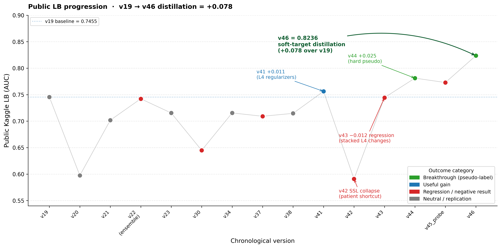
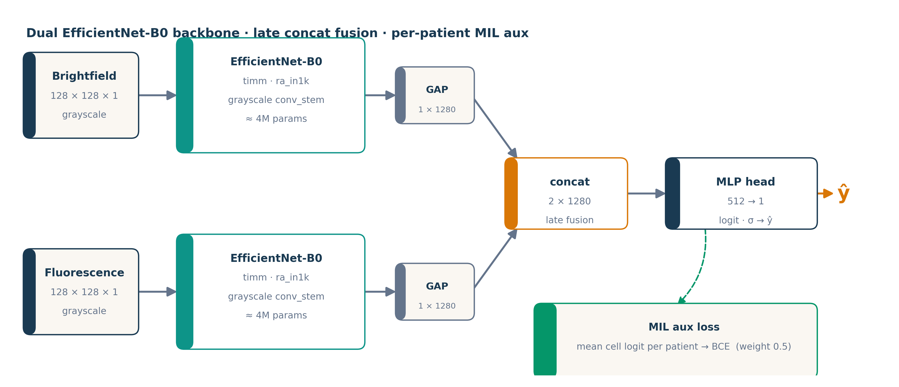

# Semi-Supervised Distillation for Small-Sample Multimodal Cancer-Cell Classification


Binary malignant/benign classification of paired **bright-field (BF) + fluorescence (FL)** oral-cancer microscopy cells, on a deliberately hard regime: **12 training patients**, ~114k labeled cells, and a **patient-disjoint** test set of 59k cells. The interesting part isn't the architecture — it's that on this small-sample regime, **growing the effective labeled set via test-set distillation beats architectural and regularization changes by an order of magnitude**, and that careful failure analysis drove every gain.

Across 30 logged Kaggle iterations the public-leaderboard AUC climbed **0.7455 → 0.8355** (+0.090 on the best single seed). The submission **peaked at #1 on the public leaderboard**; final placement is decided by the held-out private split.



---

## TL;DR — what makes this worth reading

- **A single change drove the biggest gain.** Replacing ~9,400 hard-thresholded pseudo-labels (Lee 2013) with all 59,040 *soft* teacher probabilities (Hinton 2015 "dark knowledge") gave **+0.042 LB** — the only delta in the whole project that clears a 4σ significance bar against the empirically-measured seed-noise floor.
- **An honest noise-floor analysis.** Using 3 submitted seeds per recipe, each headline gain is scored as a multiple of the per-seed standard error. Result: the soft-pseudo gain is *robust* (4.13σ), the round-2 noisy-student gain is *indistinguishable from zero* (0.27σ). Most competition writeups never check this.
- **Seven diagnosed failure modes**, each with a mechanism (not just "it didn't work"): a contrastive-SSL run that learned the patient-identity shortcut, a 4-change stack that confounded its own ablation, a within-recipe ensemble that went net-negative under an outlier seed, and more.
- **A per-cell finding generated *from* the data:** 97% of the disagreement between the best single seed and the ensemble is concentrated in the teacher's uncertain "middle band" — evidence the best-seed lift is signal, not leaderboard luck. This directly motivated the next experiment.
- **Reproducible figure + analysis pipeline:** every figure and statistic in the paper regenerates from a script over committed prediction CSVs.

Full writeup: **[`overleaf-report/main.tex`](overleaf-report/main.tex)** (IEEE conference format). Version-by-version log: **[`LB_HISTORY.md`](LB_HISTORY.md)**.

---

## The approach

EfficientNet-B0 **dual-branch** (one encoder per modality) with late concat fusion, a per-patient **multiple-instance-learning auxiliary loss**, AdaBN + test-set stain normalization, 3-seed × SWA ensembling, and 40-way test-time augmentation.



The decisive lift came from a **semi-supervised pipeline** that uses the unlabeled test set itself as extra training signal:

| Step | Idea | Reference | Public-LB effect |
|---|---|---|---|
| **v44** | Hard pseudo-labels: keep ~9,400 confident test cells (p<0.05 / p>0.95) | Lee 2013 | **+0.025** over v41 |
| **v46** | Soft-target distillation: keep **all** 59,040 test cells, raw teacher probability as the BCE target | Hinton 2015 | **+0.042** — largest single gain (4.13σ) |
| **v47** | Iterative noisy student round 2: swap the teacher to the v46 ensemble | Xie 2020 | +0.003 ensemble (0.27σ, **at saturation**) |
| **v48+** | Backbone & fusion diversity (EfficientNet-B2/B3, ResNet-50, ConvNeXt, early-fusion) distilled from the best seed, for a cross-architecture ensemble | — | in progress |

The headline methodological claim: with 12 patients the model is **data-bound, not capacity-bound**. The four-regularizer textbook stack (label smoothing + dropout + RandomResizedCrop + multiscale TTA) bought +0.011; "add the test set as soft pseudo-labels" bought +0.042.

---

## What's in the repo

| Path | Description |
|---|---|
| [`overleaf-report/`](overleaf-report/) | **IEEE conference paper** — `main.tex`, `refs.bib`, four figure PDFs, and the auto-generated noise-floor table. Drop-in Overleaf upload. `figure-sources/` holds the build scripts; `notes/` holds section drafts. |
| [`LB_HISTORY.md`](LB_HISTORY.md) | Every Kaggle submission in order: exact recipe diff, public LB, one-line lesson, and the seven negative-result post-mortems. |
| [`presentation/`](presentation/) | In-class slide deck (`.pptx`) + the figure PNGs embedded above. |
| [`notebooks/`](notebooks/) | One self-contained source notebook per iteration (`improvedvNN_source.ipynb`), runnable end-to-end on a Kaggle T4 ×2. |
| [`results/`](results/) | Per-version submission CSVs (incl. per-seed extracts) + `cpu_ensembles/` recombination probes. Committed for reproducibility; raw training artifacts are gitignored. |

---

## Reproducing the figures and analysis (CPU-only, no GPU)

```bash
pip install numpy pandas matplotlib pypdf python-pptx

# Regenerate the LB-progression chart (writes PNG for the deck + PDF for the paper)
python overleaf-report/figure-sources/build_lb_progression.py

# Re-run the noise-floor significance analysis (writes the LaTeX table the paper \input's)
python overleaf-report/figure-sources/build_noise_floor_analysis.py

# Re-run the per-cell best-seed-vs-ensemble analysis (the "97% middle-band" finding)
python overleaf-report/figure-sources/build_v47_seed_vs_ensemble_analysis.py
```

## Reproducing a training run (GPU, on Kaggle)

1. Open a source notebook (e.g. `notebooks/improvedv47_source.ipynb`) on Kaggle.
2. Attach the inputs listed in the notebook's header cell: the competition dataset, plus a teacher-prediction dataset for distillation runs (e.g. `submissionv46` for v47).
3. **Save Version → Save & Run All.** The notebook handles caching, training, SWA, AdaBN, 40-way TTA, and writes ensemble + per-seed submission CSVs.

Budget: one Kaggle T4 ×2 commit run, ~5–6 h per distillation version. No HPC used.

See [`requirements.txt`](requirements.txt) for the full dependency split.

---

## A few of the diagnosed failure modes

These are documented in full in the paper (§VII) and `LB_HISTORY.md`; a sample of the kind of analysis:

- **Contrastive SSL learned the patient shortcut (v42).** A CoMIR-style cross-modal InfoNCE pretrain collapsed to LB 0.59 with train-AUC 0.96. With one patient per cell, paired (BF, FL) of the same cell always share a patient — so the contrastive task is solvable by encoding *patient identity*, exactly the spurious signal a patient-disjoint test set punishes.
- **Stacking unvalidated changes confounds the ablation (v43).** Four simultaneous tweaks regressed −0.012 and made it impossible to attribute. The fix (v46, which selectively reverted two of them) recovered +0.079. Lesson encoded: one or two related changes per submitted version.
- **Within-recipe ensembling is not unconditionally safe (v47).** The 3-seed ensemble landed *below* its own best seed by 0.009, because round-2 noisy student widened seed dispersion ~3× and produced an outlier. Whether that outlier is signal or split-luck is left as an explicit open question — and the per-cell analysis leans toward signal.

---

## Course context

Produced as Assignment 3 of **Uppsala University 1MD042 — Advanced Deep Learning for Image Processing** (Spring 2026). Grading weights methodology and presentation over leaderboard rank, which is why the negative-results analysis and the noise-floor framing are front-and-center rather than the score.

## License

MIT — see [`LICENSE`](LICENSE). The reference-paper PDFs and the competition dataset are **not** included (the latter is gitignored); see [`REFERENCES.md`](REFERENCES.md) for citations.
