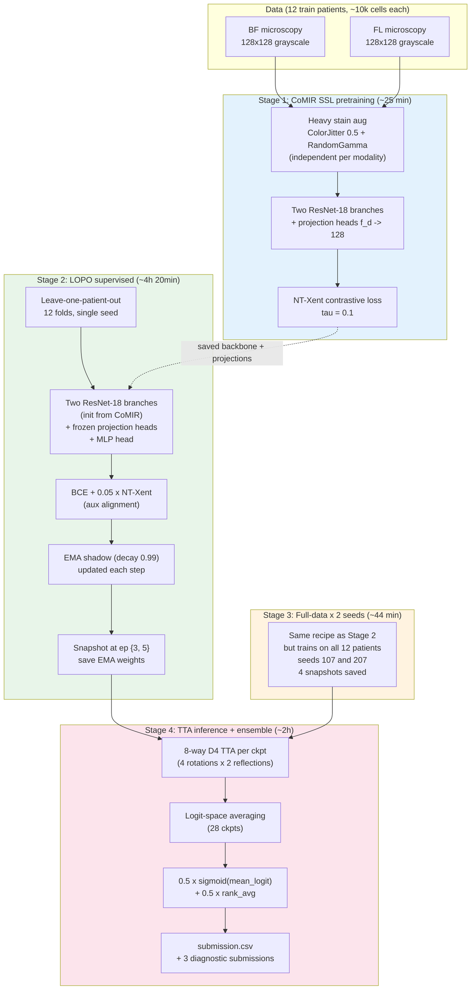
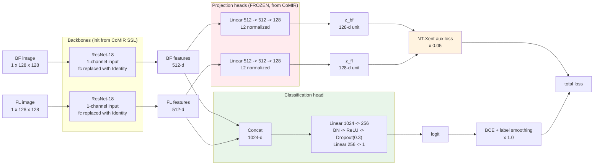
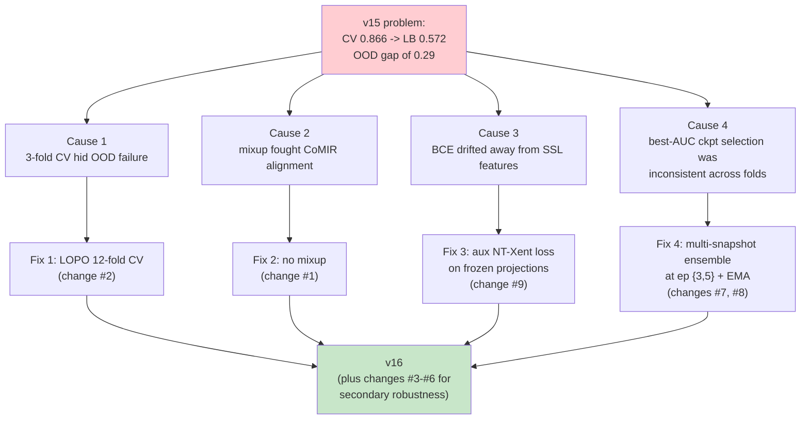

# v16 methods — end-to-end diagram

GitHub renders Mermaid diagrams natively. Open this file on GitHub for the visual; the text below works as the source-of-truth for the README and report.

---

## Overall pipeline

---

## The model architecture

Key points:
- The two branches are **independent** ResNet-18 networks (no weight sharing).
- The projection heads come from CoMIR SSL and stay **frozen** during supervised fine-tune. Gradient still flows *through* them to the backbones — they shape the alignment signal but don't drift away from their SSL solution.
- Inference uses only the `logit` path; the projection heads cost nothing at test time.

---

## Why this architecture?

---

## Compute timing on Kaggle T4×2 (only GPU 0 used)

```mermaid
gantt
    title v16 Kaggle commit timeline (~8h 15min)
    dateFormat HH:mm
    axisFormat %H:%M

    section Setup
    JPEG cache to RAM           :a1, 00:00, 45m

    section Stage 1: SSL
    CoMIR contrastive pretrain  :a2, after a1, 25m

    section Stage 2: LOPO
    12 folds x 6 epochs         :a3, after a2, 4h 20m

    section Stage 3: Full-data
    2 seeds x 6 epochs          :a4, after a3, 44m

    section Stage 4: Inference
    28 ckpts x 8-way D4 TTA     :a5, after a4, 2h

    section Buffer
    headroom under 9h limit     :a6, after a5, 45m
```

Total: **~8h 15min** of compute, leaving ~45 min of headroom under Kaggle's 9-hour commit ceiling. The cache step is the only one that has to run sequentially before anything else; all other stages depend on the previous one but use only GPU 0.

---

## If Mermaid doesn't render

GitHub renders Mermaid blocks automatically when the file is viewed in the web UI. If you're reading this in an editor that doesn't render Mermaid, install the [Mermaid VSCode extension](https://marketplace.visualstudio.com/items?itemName=bierner.markdown-mermaid) or paste the diagram source into <https://mermaid.live/>.
